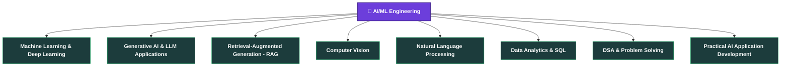

# 👋 Hi, I'm SAI KIRAN BOYA

### AI/ML | Generative AI & LLM Applications | Computer Vision | RAG | Data Analytics

AI/ML undergraduate focused on building practical intelligent applications across Generative AI, Computer Vision, Machine Learning, and Data Analytics.

  
  
  
  

---

## 🧠 AI Journey

- 🎓 B.Tech student in **Artificial Intelligence & Machine Learning** at Sri Indu College of Engineering & Technology, Telangana
- 🤖 Skilled in **Data Structures & Algorithms, Machine Learning, Data Analytics, and Generative AI**
- 🐍 Proficient in **Python and SQL**, with hands-on experience building AI applications
- 🧩 Hands-on experience with **LLMs, RAG, Deep Learning, and NLP**
- 👁️ Practical exposure to **Computer Vision** through real-world projects
- 🚀 Seeking internship opportunities in **AI/ML, Data Science, and Software Development**

---

## 🧰 Technical Arsenal

**🤖 AI & Machine Learning**

**🧠 Generative AI & LLMs**

**👁️ Computer Vision**

**📊 Data & Analytics**

**💻 Development**

**🛠️ Developer Tools**

---

## 🚀 Selected AI Projects

### 🤖 SarojaAstra AI — Intelligent AI Assistant

Developed a multimodal AI assistant integrating local LLMs, conventional memory, document intelligence, and real-time web search for context-aware responses across documents and web-based queries.

**Key capabilities**
- Multimodal AI interaction with local LLMs
- Document intelligence and RAG-based question answering
- Vector database search (LangChain-powered retrieval)
- Real-time web search integration
- Support for online/offline AI workflows
- Context-aware responses across documents and web queries

**Tech stack:** Python • LLMs • RAG • LangChain • Vector Databases • FastAPI • React

---

### 🏥 MedAssistAI — AI Healthcare Application

Developing an AI-based application for disease prediction using Python and Scikit-learn, with a machine-learning pipeline covering data preprocessing, model training, evaluation, and deployment — achieving **90% test accuracy**.

**Key areas**
- Disease prediction
- Data preprocessing
- Machine learning model training
- Model evaluation
- Deployment

**Performance:** 90% test accuracy

**Tech stack:** Python • Scikit-learn • Machine Learning • Data Preprocessing

---

### 🎥 ClassVision AI — Face Recognition Attendance System

A smart attendance management system using real-time face recognition with QR-based backup attendance.

**Key features**
- Real-time face-recognition attendance
- Student registration and face dataset capture
- Global duplicate-face prevention
- QR-based backup attendance
- Attendance sessions and attendance editing
- Audit tracking and faculty authentication
- Student profiles and attendance management

**Tech stack:** Python • OpenCV • Flask • SQLite • JavaScript • Pandas • NumPy

🔗 [View Repository](https://github.com/saikiranboya955/CLASSVISION-AI)

---

### 🌾 HarvestHub — AI-Driven Agricultural Platform

An AI-driven agricultural platform exploring practical machine learning applications for farming decisions.

**Key areas**
- Crop recommendation
- Agricultural price forecasting
- Multilingual interaction
- Voice assistance

---

### ✋ Neon Aura AR — Real-Time AI Hand Tracking & Interactive Digital Art

A browser-based computer-vision experience using MediaPipe Hands to transform real-time hand movements into interactive visual effects.

**Key features**
- Tracks up to two hands with 21 landmarks per hand
- Real-time gesture recognition
- Pinch and fist/open-hand detection
- Finger-spread calculation
- Interactive visual effects with two-hand interaction
- Web Audio integration and multiple visual themes

**Tech stack:** MediaPipe • JavaScript • HTML5 Canvas • Web Camera API • Web Audio API

🔗 [View Repository](https://github.com/saikiranboya955/HANDS-DETECTION-AI)

---

## 💼 Professional Experience

**Infosys Springboard** — Artificial Intelligence Intern
*July 2026 – Present*
- Developing MedAssistAI for disease prediction using Python and Scikit-learn, achieving 90% test accuracy
- Working across the ML pipeline: data preprocessing, model training, evaluation, and deployment

**Codec Technologies India** — Python Developer Intern
*August 2025 – November 2025*
- Developed Python applications using OOP and modular programming
- Worked on project-based problem solving, file handling, and exception handling
- Contributed to debugging, and building and maintaining Python applications

---

## 🌱 Professional Learning

- **TATA / Forage** — GenAI-Powered Data Analytics Job Simulation
- **Accenture** — AI Job Simulation
- **Oracle Cloud** — Generative AI
- **DataFlair** — MySQL
- **Infosys Springboard** — AI/ML/NLP
- **GeeksforGeeks** — DSA with Python
- **GeeksforGeeks** — Python

---

## 🎓 Education

**Sri Indu College of Engineering & Technology, Telangana**
B.Tech, Artificial Intelligence and Machine Learning
2023 – 2027 | CGPA: 7.5/10

---

## 🎯 Current Focus

---

## 🔬 How I Build AI Solutions

---

### 💡 Build. Learn. Experiment. Repeat.

Thanks for visiting my profile! ⭐

